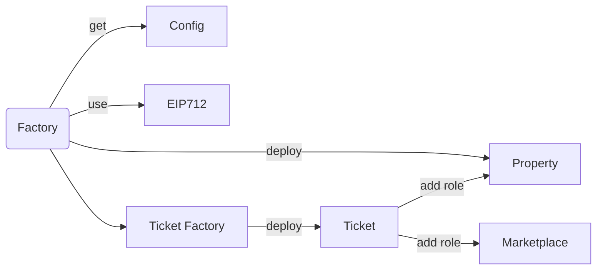

## Bookadot Solidity Smart Contract

```mermaid
graph LR
Factory(Factory) -->|get| Config[Config]
Factory(Factory) -->|use| EIP712[EIP712]
Factory --> |deploy| Property[Property]
Factory --> TicketFactory[Ticket Factory]
TicketFactory --> |deploy| Ticket[Ticket]
Ticket --> |add role| Property
Ticket --> |add role| Marketplace[Marketplace]
```

### Deploy step
1. Config
2. Ticket factory
3. Factory

- Property bookBatch
- Ticket locked
